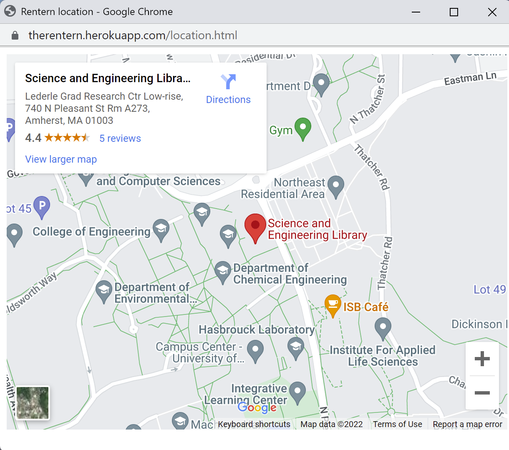
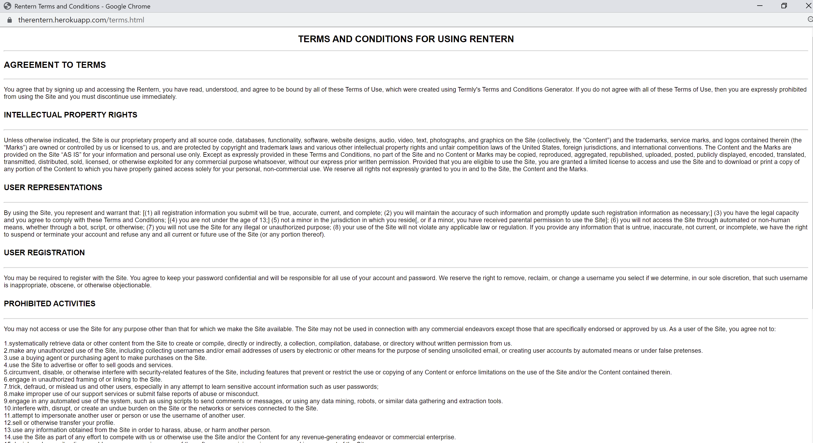
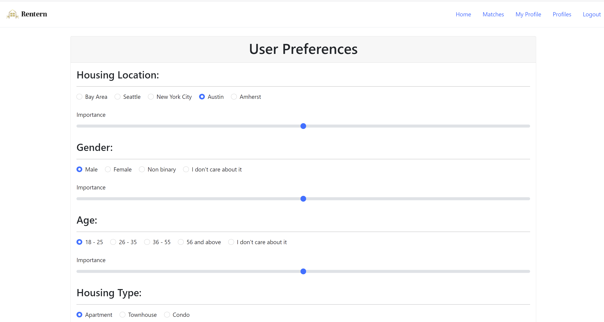
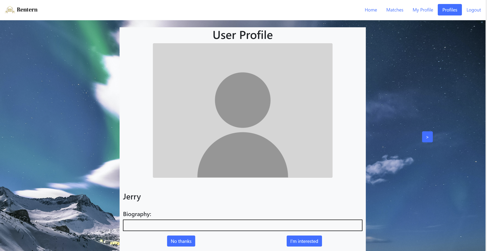
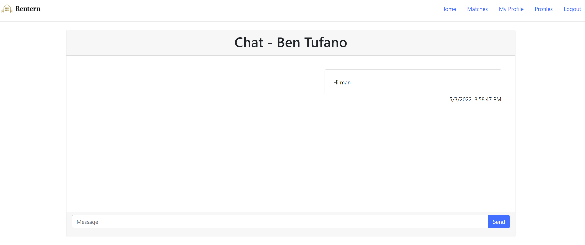

# CS326 Team 8: ctrlelite - The Rentern
### **Spring 2022**

## Overview

Our project is to design and implement a corporate roommate finder — for example, if you are offered a new job and need to relocate, under such circumstances you are looking for new roommates to rent a house, you can sign up for our website by a valid email account and a password, specify the user preferences including housing location, housing type, age/gender preference, sleep schedule, cleanliness, and things to share, etc. And the website will provide recommended matches so they can send interests, chat and potentially become roommates.

## Team Members

* Conlan Cesar	         ([@HeroCC](https://github.com/HeroCC))
* Benjamin Tufano        ([@tufanobenjamin](https://github.com/tufanobenjamin))
* Liam Neal Reilly       ([@lhnealreilly](https://github.com/lhnealreilly))
* Yichong Liu            ([@YiChong_Liu](https://github.com/YiChong-Liu))

## The Backend

### User Interface

Home page


Staff page


Address page



Signup page


Login page


Terms and conditions page



User preference page



User profile page


Profiles page



Match page


Chat page



### API Endpoints

##### PUT /api/users/newUser:

Create a new user in the Rentern database. Arguments required: Email, Password.

Query Parameters: Email, Password

Requires JWT authentication: FALSE

Example API call:
```
await fetch('/api/users/newUser',
    {
        method: 'PUT'
        body:
        {
            email: 'name@user.com',
            password: '1234'
        }
    });
```
Response:
```
{
    "worked" : true,
    "email" : "name@user.com",
    "password" : "1234"
}
```
If accepted is false, the user was not created. Likely because there exists a user in the database with the email already created.

---

##### PUT /api/matches/acceptMatch

Attempts to accept a match betwen 2 users. It checks if a match has already been initilized (by the other user) and accepts if so. If not it initializes a match in the database that can be accepted by the other user.

Query Parameters: user, user2

Requires JWT authentication: TRUE

Example API call:
```
await fetch('/api/matches/acceptMatch',
    {
        method: 'PUT'
        {
            user : 123,
            user2 : 87654321
        }
    });
```
Response:
```
{
    "worked" : true,
    "user2" : 87654321
}
```
If worked is false, the other user has not accepted the match yet. A match is created, but flagged as partially accepted.

---
##### POST /api/msg/newChatMsg

Create a new message from one user to another.

Requires JWT authentication: TRUE

Query Parameters: user2

Body: msg

Example API call:
```
await fetch('/api/msg/newChatMsg,
    {
        method: 'POST'
        body:
        {
            user2: 123456,
            msg: "Hello World"
        }
    });
```
Response:
```
{
    "worked" : true,
    "msg_content" : Hello World
}
```

##### GET /api/msg/fetch

Fetch a number of messages between two users.

Requires JWT authentication: TRUE

Query Parameters: userTo, msgAmt(default 20)

Example Fetch:
```
await fetch('/api/msg/newChatMsg?userTo=87654321&msgAmt=25');
```
Response:
```
{
    "worked" : true,
    "msg_object" :
        {
            "fromMsgs" : ["qqqqqq", "qwqwqeqwe", ...],
            "toMsgs" : ["vfvfvfv", "vfvfsdsfa", ...]
        }
}
```

---

##### GET /api/matches

Get the list of matches for a user.

Requires JWT authentication: TRUE

Example Fetch:
```
await fetch('/api/matches');
```
Response:
```
{
    "worked" : true,
    "user" : "10290291", //This comes from the JWT in the cookie
    "user_matches" : ["1", "2", "3", ...]
}
```

---

##### GET /api/user/data

Fetches the profile and preferences of the given user.

Requires JWT authentication: TRUE

Query Parameter: user

Example Fetch:
```
await fetch('/api/user/data?user=1234');
```
Response:
```
{
    "worked" : true,
    "user" : "1234",
    "potential_matches" : ["1", "2", "3", ...]
}
```
---

##### GET /api/matches/potentialMatches

Requires JWT authentication: TRUE

Example Fetch:
```
await fetch('/api/user/data');
```
Response:
```
{
    "worked" : true,
    "user" : "10290291", //This comes from the JWT in the cookie
    "user_data" :
        {
            "profile" :
            {
                "bio" : "lorem ipsum",
                "profilePicture" : "img.png",
                "userName": "John Smith"
            }
            "preferences" :
            {
                "cleanlines" : 10,
                "bedtime" : 2200
            }
        }
}
```

##### PUT /api/update/userPreferences

Update userPreferences database with new preferences for the user.

Example API call:
```
await fetch('/api/update/userPreferences',
    {
        method: 'PUT'
        body:
        {
            "preferences" :
            {
                "cleanlines" : 10,
                "bedtime" : 2200
            }
        }
    });
```
Response:
```
{
    "worked" : true,
    "user" : "10290291", //This comes from the JWT in the cookie
    "preferences" :
    {
        "cleanlines" : 10,
        "bedtime" : 2200
    }
}
```

---

##### PUT /api/update/userProfile

Update userProfile database with new profile informtaion for the user.

Example API call:
```
await fetch('/api/update/userProfile',
    {
        method: 'PUT'
        body:
        {
            "profile" :
            {
                "bio" : "lorem ipsum",
                "profilePicture" : "img.png",
                "userName": "John Smith"
            }
        }
    });
```
Response:
```
{
    "worked" : true
    "user" : "10290291", //This comes from the JWT in the cookie
    "profile" :
    {
        "bio" : "lorem ipsum",
        "profilePicture" : "img.png",
        "userName": "John Smith"
    }
}
```

---

##### PUT /api/update/userPassword

Update the user's password

Example API call:
```
await fetch('/api/update/userPassword',
    {
        method: 'PUT'
        body:
        {
            "password" : "1234"
        }
    });
```
Response:
```
{
    "worked" : true,
    "user" : "10290291", //This comes from the JWT in the cookie
    "password" : "1234"
}
```

##### DELETE /api/delete/user

Deletes a user from the users database.

Example API call:
```
await fetch('/api/delete/user',
    {
        method: 'DELETE'
    });
```
Response:
```
{
    "worked" : true,
    "user" : "10290291", //This comes from the JWT in the cookie
}
```

##### DELETE /api/delete/match

Deletes a match between 2 users.

Example API call:
```
await fetch('/api/delete/user',
    {
        method: 'DELETE'
        body:
        {
            "user2" : "1234"
        }
    });
```
Response:
```
{
    "worked" : true,
    "user" : "10290291", //This comes from the JWT in the cookie
    "user2" : "1234"
}
```

<br>

### Databases

##### 5 Tables:
- [Users](#users)
- [UserPreferences](#userpreferences)
- [UserProfiles](#userprofiles)
- [Matches](#matches)
- [Chat](#chat)


##### Users
|  Column  |          Type          | Description |
| --- | --- | --- |
 uid      | uuid                   | The user's unique ID.
 password | character varying(450) | The user's password stored as a hash.
 email    | character varying(50)  | The user's email address.

##### UserPreferences
|  Column  |          Type          | Description |
| --- | --- | --- |
 uid                   | uuid                  | The user's unique ID.
 state                 | character varying(40) | The user's state.
 city                  | character varying(40) | The user's city.
 gender                | character varying(20) | The user's gender.
 genderimportance      | numeric               | The user's importance level of a roommate sharing their gender.
 age                   | character varying(40) | The user's age range ('teenage', etc.)
 ageimportance         | numeric               | The user's importance level of a roommate sharing their age-range.
 housingtype           | character varying(20) | The user's preference of housing type.
 housingtypeimportance | numeric               | The user's importance level of a roommate sharing their housing type.
 noiselevel            | character varying(30) | The user's preferred noise level.
 noiseimportance       | numeric               | The user's importance level of a roommate sharing their noise level.
 cleanliness           | character varying(40) | The user's preferred cleanliness level.
 cleanlinessimportance | numeric               | The user's importance level of a roommate sharing their cleanliness.
 sharing               | character varying(40) | The user's stance on sharing.
 sharingimportance     | numeric               | The user's importance level of a roommate sharing their stance on sharing.

##### UserProfiles
|  Column  |          Type          | Description |
| --- | --- | --- |
 uid         | uuid | The user's unique ID.
 profilejson | text | The Stringified JSON of the user's profile information (bio, name, profilePicture)

##### Matches
|  Column  |          Type          | Description |
| --- | --- | --- |
 uid1     | uuid   | The unique ID of one of the users in the match.
 uid2     | uuid   | The unique ID of one of the users in the match.
 u1accept | bit(1) | Whether uid1 has accepted the match or not.
 u2accept | bit(1) | Whether uid2 has accepted the match or not.

##### Chat
|  Column  |          Type          | Description |
| --- | --- | --- |
 uid1   | uuid                        | The unique ID of the user that sent the message.
 uid2   | uuid                        | The unique ID of the user that received the message.
 msg    | text                        | The body text of the message.
 time   | timestamp without time zone | The timestamp of the message in UTC time.

<br>
<br>
<br>

### URL  Routes/Mappings


### Authentication and Authorization

We decided, rather than using state in the backend, to use JSON-Web-Tokens. This allows us to restart our backend or loadbalance to different nodes, without needing to manage the state of the user's login in the background.

When a user logs in or registers, the page makes a request to those API endpoints (these are the only endpoints that don't require authentication). If the request is valid, we send back a new cookie with a cryptographically secure value, which when decoded, contains the user's ID. The client can attempt to modify this value, but we can verify its authenticity in the backend, so it is not possible to simply log in as another user.

Further requests contain the cookie, which the backend verifies is secure and non-expired. If the user is allowed, the proper data is returned, otherwise throwing an HTTP 401 error.

All users have the same privileges basic -- there is no concept of an admin or super user. All registered users are visible in the profile matching page. Only you are allowed to upload your new profile information or change your preferences.
### Division of Labor:

Conlan Cesar: Front-end+ back-end, Postgres Integration, Heroku Deployment, commit management, JWT authentication, documentation

Benjamin Tufano: Back-end,API endpoints, userPreferences Connection, DB integration, Heroku deployment, documentation

Liam Neal Reilly: Back-end, faker integration, Database, API endpoints, User profile, Chat, Heroku deployment, documentation

Yichong Liu: Front-end, User Preferences Design, Matching Algorithm, Social Media, Heroku deployment, documentation

### Conclusion

Yichong Liu: Throughout this project, I learned how to make websites look more beautiful, heroku deployment and how to cooperate with back-end colleagues to meet specific needs. The overall experience is great! And I'm looking forward to finish and improve the matching algorithm, and learn more about web programming in the future! \
Liam Neal Reilly: Although I had experience with many of the concepts such as SQL, html, js etc. The process of building and deploying an website from start to finish with a team was a great learning experience.
