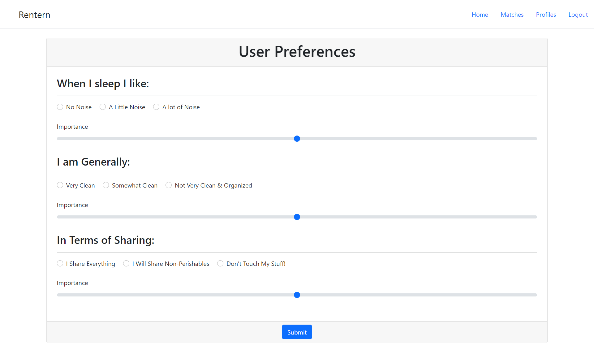

# CS326 ctrlelite: Rentern

### Team Members

* Conlan Cesar           ([@HeroCC](https://github.com/HeroCC))
* Benjamin Tufano        ([@tufanobenjamin](https://github.com/tufanobenjamin))
* Liam Neal Reilly       ([@lhnealreilly](https://github.com/lhnealreilly))
* Yichong Liu            ([@YiChong_Liu](https://github.com/YiChong-Liu))

### Data Interactions (Bullet list of interactions)
* User creates an account (username/password)
* Users add personal information (Name, biography)
* Users choose preferences (Budget, Cleanliness, Company)
* User can add/change a profile picture
* On the profiles page users see other peoples’ profiles (personal information, preferences, profile picture)
* Users have private messages with other users 

### Wireframe Site Layout

### HTML Mockups

