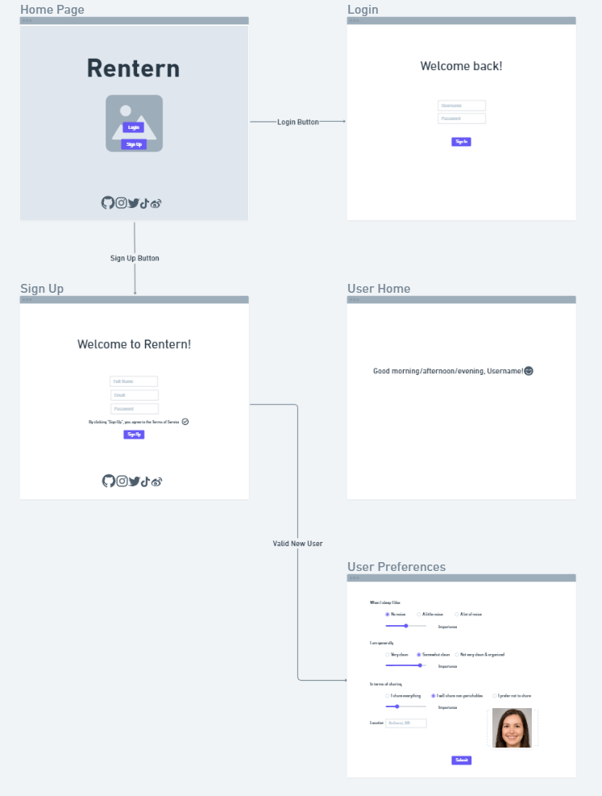
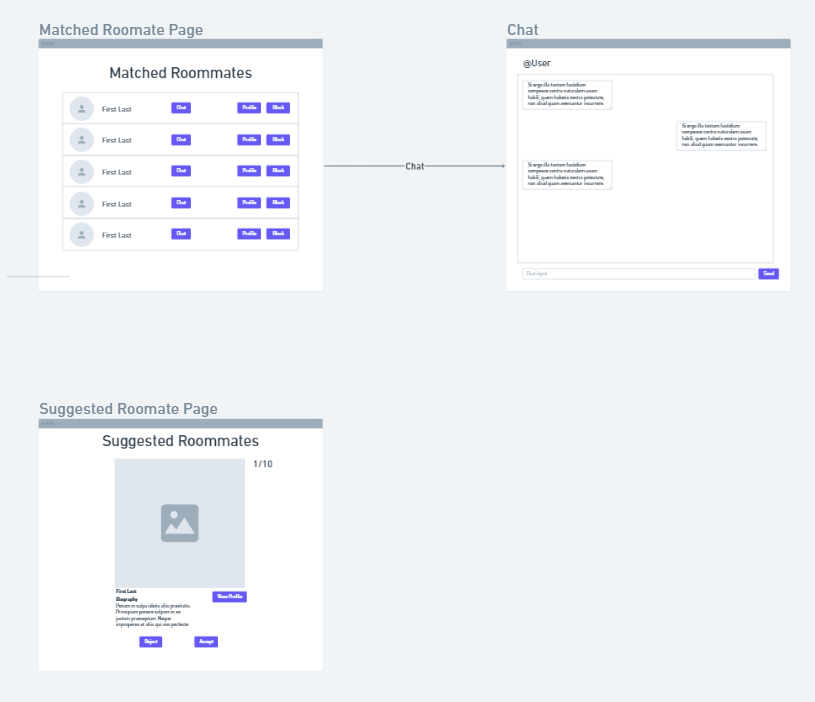
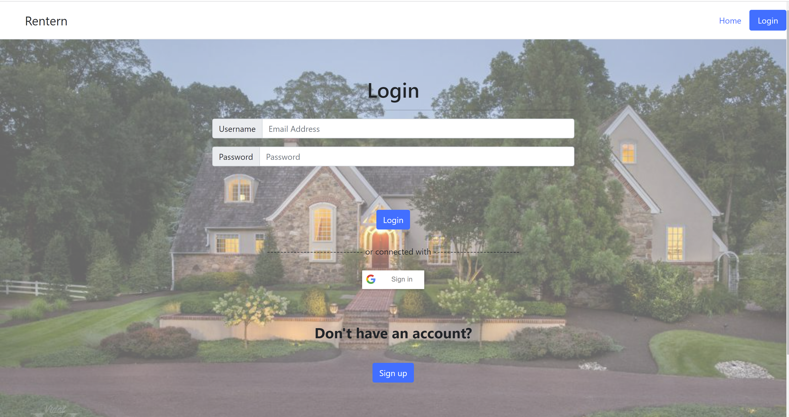
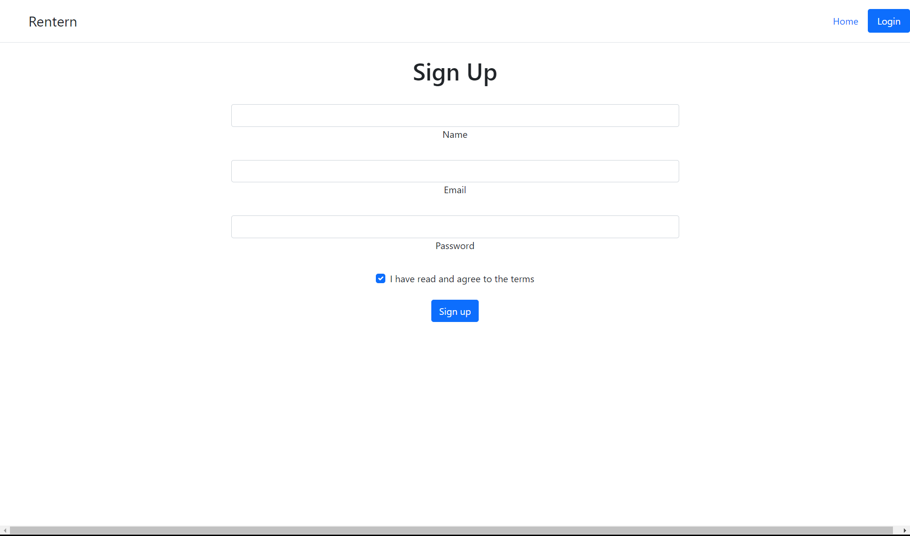
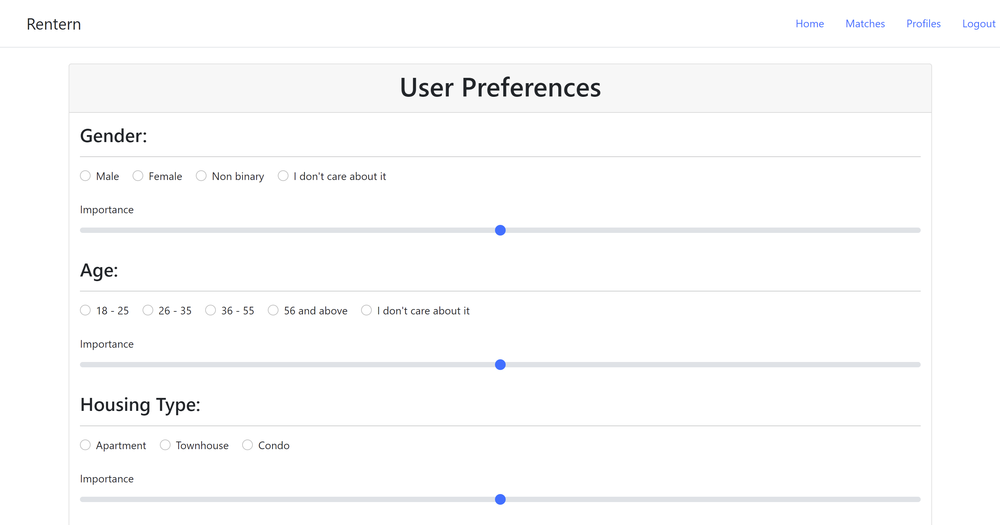
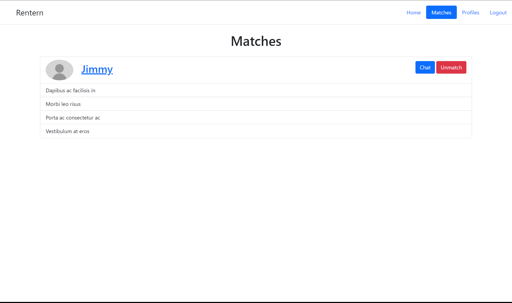
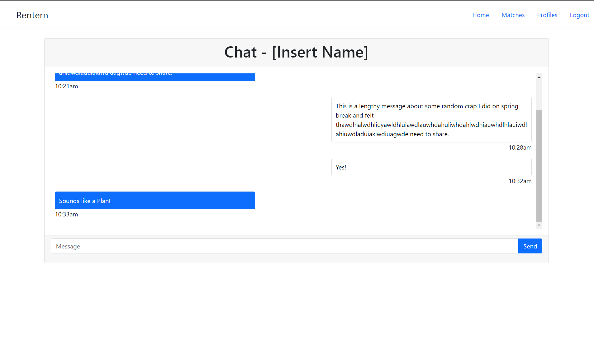
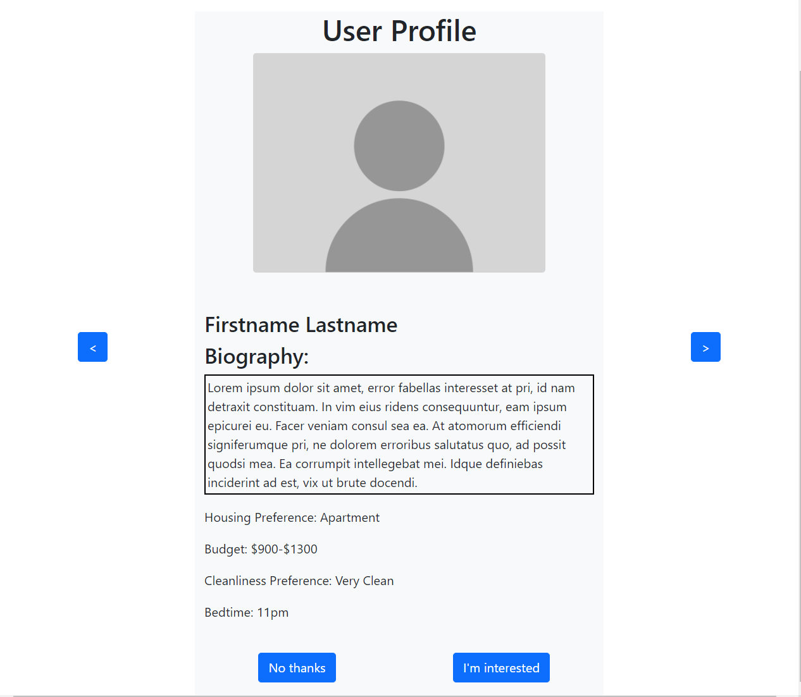

# CS326 ctrlelite: Rentern

### Team Members

* Conlan Cesar           ([@HeroCC](https://github.com/HeroCC))
* Benjamin Tufano        ([@tufanobenjamin](https://github.com/tufanobenjamin))
* Liam Neal Reilly       ([@lhnealreilly](https://github.com/lhnealreilly))
* Yichong Liu            ([@YiChong_Liu](https://github.com/YiChong-Liu))

### Data Interactions (Bullet list of interactions)
* User creates an account (username + password)
* Users add personal information (Name, biography)
* Users choose preferences (age/gender preference, sleep schedule, cleanliness, etc)
* User can add/change a profile picture
* On the profiles page users see other peoples’ profiles (personal information, preferences, profile picture)
* Users have private messages with other users 

### Wireframe Site Layout

### HTML Mockups

Home page:

### Breakdown of the division of labor

Conlan Cesar: boostrap template, login.html, index.html, commit management, front-end style suggestions, logout button, etc.

Benjamin Tufano: chat.html. userPreference.html, index.html, login.html, main.css

Liam Neal Reilly: profile.html, milestone1.md, main.css

Yichong Liu: index.html, signup.html, login.html, matches.html, main.css, milestone1.md, front-end style suggestions, code debugging, etc.