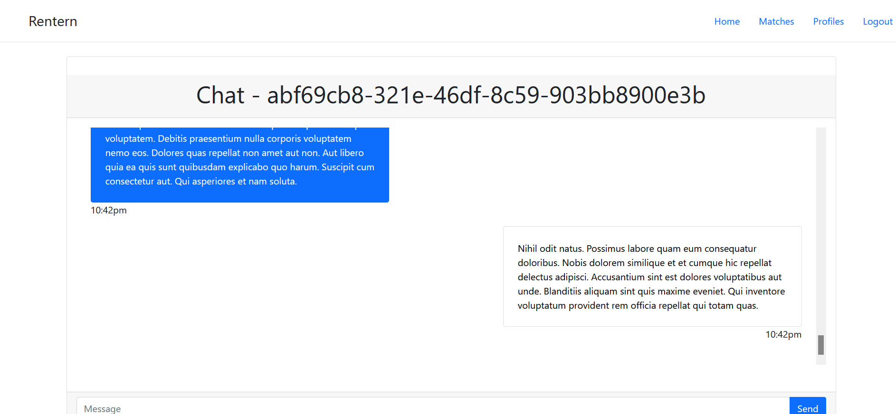
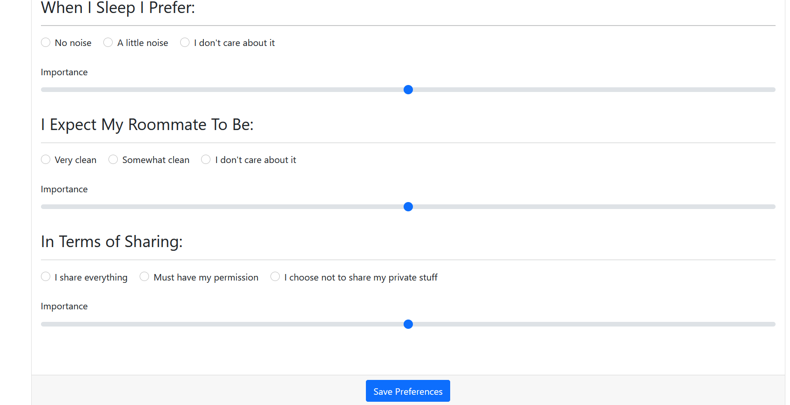
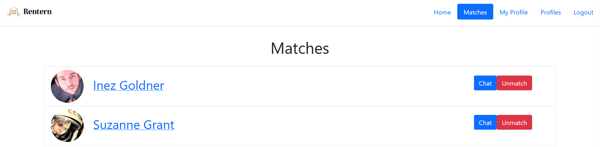

# Milestone 2 Documentation

[REST CRUD API:](#rest-crud-api)
- [Create Operations](#create-operations)
  - [PUT /api/users/newUser:](#put-apiusersnewuser)
  - [PUT /api/matches/acceptMatch](#put-apimatchesacceptmatch)
  - [POST /api/msg/newChatMsg](#post-apimsgnewchatmsg)
- [Read Operations](#read-operations)
  - [GET /api/msg/fetch](#get-apimsgfetch)
  - [GET /api/matches](#get-apimatches)
  - [GET /api/user/data](#get-apiuserdata)
  - [GET /api/matches/potentialMatches](#get-apimatchespotentialmatches)
- [Update Operations](#update-operations)
  - [PUT /api/update/userPreferences](#put-apiupdateuserpreferences)
  - [PUT /api/update/userProfile](#put-apiupdateuserprofile)
  - [PUT /api/update/userPassword](#put-apiupdateuserpassword)
- [Delete Operations](#delete-operations)
  - [DELETE /api/delete/user](#delete-apideleteuser)
  - [DELETE /api/delete/match](#delete-apideletematch)
- [Heroku Deployment](#heroku-link)
- [Division of Labor](#division-of-labor)


## REST CRUD API:

<br>

# Create Operations


## PUT /api/users/newUser:

Create a new user in the Rentern database. Arguments required: Email, Password.

Query Parameters: Email, Password

Requires JWT authentication: FALSE

Example API call:
```
await fetch('/api/users/newUser', 
    {
        method: 'PUT'
        body:
        {
            email: 'name@user.com',
            password: '1234'
        }
    });
```
Response:
```
{
    "worked" : true,
    "email" : "name@user.com",
    "password" : "1234"
}
```
If accepted is false, the user was not created. Likely because there exists a user in the database with the email already created.

---

## PUT /api/matches/acceptMatch

Attempts to accept a match betwen 2 users. It checks if a match has already been initilized (by the other user) and accepts if so. If not it initializes a match in the database that can be accepted by the other user.

Query Parameters: user, user2

Requires JWT authentication: TRUE

Example API call:
```
await fetch('/api/matches/acceptMatch', 
    {
        method: 'PUT'
        {
            user : 123,
            user2 : 87654321
        }
    });
```
Response:
```
{
    "worked" : true,
    "user2" : 87654321
}
```
If worked is false, the other user has not accepted the match yet. A match is created, but flagged as partially accepted.

---
## POST /api/msg/newChatMsg

Create a new message from one user to another.

Requires JWT authentication: TRUE

Query Parameters: user2

Body: msg

Example API call:
```
await fetch('/api/msg/newChatMsg, 
    {
        method: 'POST'
        body: 
        {
            user2: 123456,
            msg: "Hello World"
        }
    });
```
Response:
```
{
    "worked" : true,
    "msg_content" : Hello World
}
```
# Read Operations

## GET /api/msg/fetch

Fetch a number of messages between two users.

Requires JWT authentication: TRUE

Query Parameters: userTo, msgAmt(default 20)

Example Fetch:
```
await fetch('/api/msg/newChatMsg?userTo=87654321&msgAmt=25');
```
Response:
```
{
    "worked" : true,
    "msg_object" : 
        {
            "fromMsgs" : ["qqqqqq", "qwqwqeqwe", ...],
            "toMsgs" : ["vfvfvfv", "vfvfsdsfa", ...]
        }
}
```

---

## GET /api/matches

Get the list of matches for a user.

Requires JWT authentication: TRUE

Example Fetch:
```
await fetch('/api/matches');
```
Response:
```
{
    "worked" : true,
    "user" : "10290291", //This comes from the JWT in the cookie
    "user_matches" : ["1", "2", "3", ...]
}
```

---

## GET /api/user/data

Requires JWT authentication: TRUE

Example Fetch:
```
await fetch('/api/user/data');
```
Response:
```
{
    "worked" : true,
    "user" : "10290291", //This comes from the JWT in the cookie
    "potential_matches" : ["1", "2", "3", ...]
}
```
---

## GET /api/matches/potentialMatches

Requires JWT authentication: TRUE

Example Fetch:
```
await fetch('/api/user/data');
```
Response:
```
{
    "worked" : true,
    "user" : "10290291", //This comes from the JWT in the cookie
    "user_data" :
        {
            "profile" :
            {
                "bio" : "lorem ipsum",
                "profilePicture" : "img.png",
                "userName": "John Smith"
            }
            "preferences" : 
            {
                "cleanlines" : 10,
                "bedtime" : 2200
            }
        }
}
```

# Update Operations

## PUT /api/update/userPreferences

Update userPreferences database with new preferences for the user.

Example API call:
```
await fetch('/api/update/userPreferences', 
    {
        method: 'PUT'
        body: 
        {
            "preferences" : 
            {
                "cleanlines" : 10,
                "bedtime" : 2200
            }
        }
    });
```
Response:
```
{
    "worked" : true,
    "user" : "10290291", //This comes from the JWT in the cookie
    "preferences" :
    {
        "cleanlines" : 10,
        "bedtime" : 2200
    } 
}
```

---

## PUT /api/update/userProfile

Update userProfile database with new profile informtaion for the user.

Example API call:
```
await fetch('/api/update/userProfile', 
    {
        method: 'PUT'
        body: 
        {
            "profile" :
            {
                "bio" : "lorem ipsum",
                "profilePicture" : "img.png",
                "userName": "John Smith"
            }
        }
    });
```
Response:
```
{
    "worked" : true
    "user" : "10290291", //This comes from the JWT in the cookie
    "profile" :
    {
        "bio" : "lorem ipsum",
        "profilePicture" : "img.png",
        "userName": "John Smith"
    } 
}
```

---

## PUT /api/update/userPassword

Update the user's password

Example API call:
```
await fetch('/api/update/userPassword', 
    {
        method: 'PUT'
        body: 
        {
            "password" : "1234"
        }
    });
```
Response:
```
{
    "worked" : true,
    "user" : "10290291", //This comes from the JWT in the cookie
    "password" : "1234"
}
```

# Delete Operations

## DELETE /api/delete/user

Deletes a user from the users database.

Example API call:
```
await fetch('/api/delete/user', 
    {
        method: 'DELETE'
    });
```
Response:
```
{
    "worked" : true,
    "user" : "10290291", //This comes from the JWT in the cookie
}
```

# DELETE /api/delete/match

Deletes a match between 2 users.

Example API call:
```
await fetch('/api/delete/user', 
    {
        method: 'DELETE'
        body: 
        {
            "user2" : "1234"
        }
    });
```
Response:
```
{
    "worked" : true,
    "user" : "10290291", //This comes from the JWT in the cookie
    "user2" : "1234"
}
```

<br>

# CRUD Screenshots

When the signup button is clicked, /api/users/newUser is called to createa new user in the user DB. Database is not implemented yet.


When the chat page is loaded, it recieves the 20 most recent messages from each user and loads it in using /api/msg/fetch.



When the user clicks save preferences, it updates the user's preferences in the database using /api/update/userPreferences.



When the user clicks unmatch it deletes the match in the matches database using /api/delete/match.



# Heroku Link

https://therentern.herokuapp.com/

# Division of Labor

Liam: Database.js, faker integration, API documentation, userProfile.js

Ben: API endpoints in backend.js, userPreferences.js, chat.js, main.js, index.js

Conlan: API endpoints in backend.js, JWT authentication, Heroku Deployment

Yichong:  Polish the front end (footer, login page, background, icon, logo), main.js, signup.js
